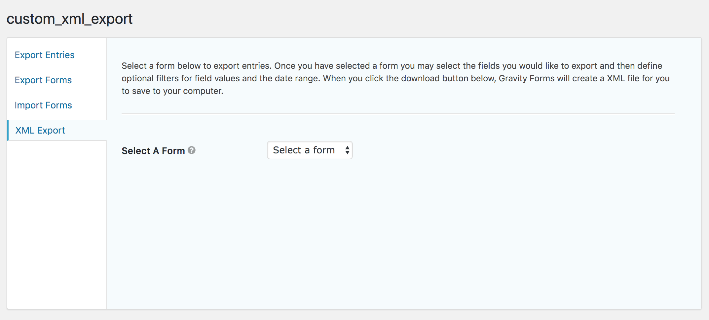
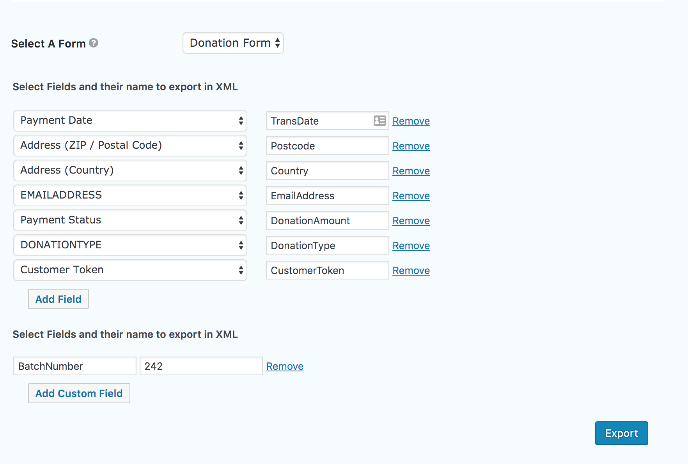

# Export Gravity form entries in XML
Wordpress Gravity forms plugin to export custom fields from entries in XML file

## Features:
1. You can **choose & re-name** fields to export in XML
2. On every export the **mapping is saved** so that you don't have to map it again
3. You can also **add fields that are not present in the entries**

You can access it : `Wordpress Admin console > Left side-bar > Forms > Import/Export > XML Export`

## Screenshots:
1. Choose multiple forms

2. Choose & name the fields you want to export in XML (mapping is saved only when you export)

3. Your XML will be exported as a file.